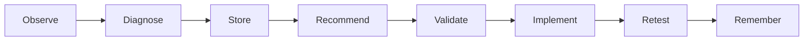

# Adaptive Learning

Last updated: 2026-05-08

## Purpose

Adaptive learning lets Signal record lessons from model runs, user feedback, diagnostics, GAMS errors, solver outcomes, and recurring issues.

## Main Modules

- `adaptive_learning.py`
- `learning_memory/`
- `signal_learning/`
- `api/routes_learning.py`

## Workflow

## Modes

- `observe_only`: record lessons only.
- `recommend`: record and recommend fixes.
- `safe_apply`: apply low-risk changes as versioned templates.

## Evidence-Based Learning

Every learning recommendation should link to:

- run id
- observed error or result
- supporting evidence
- risk level
- affected rule or template
- validation status

## Safety Principle

Signal should not silently rewrite core modeling logic. Adaptations should be versioned, reviewed, and reversible.

