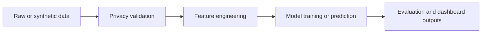

# Data Pipeline

Last updated: 2026-05-08

## Data Sources

Current data sources include:

- synthetic behavioral data
- sample preferences
- sample feedback
- sample competitors
- sample SAM files
- public aggregate trend records

## Key Folders

- `data/`
- `src/data_pipeline/`
- `src/features/`
- `ml/data_preprocessing.py`
- `privacy.py`

## Pipeline Flow

## Privacy Filtering

`src/data_pipeline/privacy_filter.py` provides:

- private column validation
- small-group suppression
- aggregate-only column handling

## Feature Engineering

Feature modules build:

- behavioral feature tables
- text features
- growth measures
- location relevance
- aggregate features

## Synthetic Data

Synthetic data is used for development, testing, demos, and fallback behavior. It should not be confused with production data.

