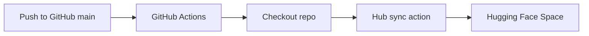

# GitHub Workflow

Last updated: 2026-05-08

## Branch

The active branch is `main`.

## Commit Practice

Use descriptive commit messages, for example:

```text
Add visible live trend intelligence feed
Fix circular import causing Gradio button _id error
Add comprehensive Signal project documentation system
```

## Hugging Face Sync

The workflow `.github/workflows/sync-to-huggingface.yml` runs on push to `main` and uses `huggingface/hub-sync@v0.1.0`.



## Recommended Pre-Push Checks

```powershell
.\.venv\Scripts\python.exe -m py_compile app.py
.\.venv\Scripts\python.exe -m py_compile trend_intelligence.py
.\.venv\Scripts\python.exe -m pytest
```

## Current Caution

The workspace contains generated model-version directories and scratch test outputs that may be untracked. Review `git status` before broad staging.

