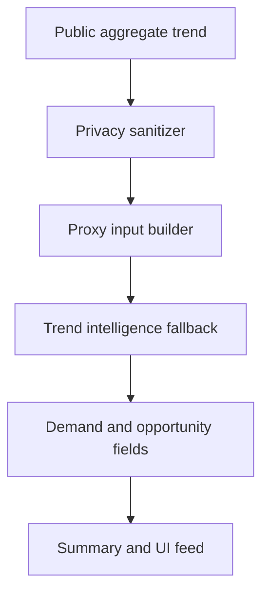

# Live Trends Module

Last updated: 2026-05-08

## Purpose

The Live Trends module converts public aggregate topical issues into Signal-style trend intelligence. It is designed to support real-time public intelligence without individual tracking.

## Current Components

- `x_trends.py`: loads location configuration, fetches public X/Twitter trends, and provides demo fallback trends.
- `trend_intelligence.py`: sanitizes records, builds proxy inputs, analyzes trend batches, and summarizes the trend set.
- `privacy.py`: validates that trend records are aggregate and safe.
- `app.py`: embeds trend UI and callbacks inside Behavioral Signals AI.

## Hidden Trend Table Logic

During the broader UI work, hidden DataFrame components were used to keep raw trend data available internally while exposing only an animated HTML feed publicly. This pattern remains useful for future work:

- hidden table: debugging and backend calculations
- visible feed: public animated intelligence surface

## Animated Live Feed

The visible emergency feed is a static `gr.HTML` card inserted near the top of the Behavioral Signals AI tab. It uses inline CSS:

- fixed-height box
- `overflow: hidden`
- vertical flex list
- `@keyframes`
- repeated topical signals can be added later

## Trend Intelligence Architecture

## Future X API Integration

The intended future live path is:

1. Configure `X_BEARER_TOKEN`.
2. Fetch WOEID-based public trends.
3. Validate aggregate-only fields.
4. Convert to Signal proxy inputs.
5. Score demand, opportunity, confidence, emerging probability, and unmet demand.
6. Display only public topic names and small aggregate labels.

## Live Intelligence Strategy

The feed should feel dynamic but remain responsible:

- Show topic names, not people.
- Show aggregate confidence labels.
- Avoid exposing raw API payloads.
- Support fallback data for demos and hosted environments.

