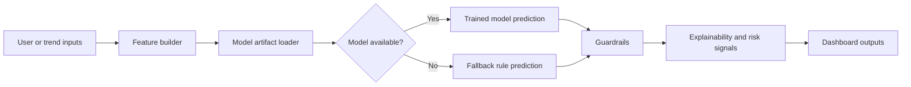

# Signal Project Overview

Last updated: 2026-05-08

## What Signal Is

Signal is an AI market and policy intelligence platform for converting aggregate behavioral signals into practical demand, opportunity, and policy insights. The repository combines a Gradio dashboard, machine-learning demand models, privacy-preserving data pipelines, live public trend intelligence, adaptive learning, and SML/CGE economic modeling workflows.

Signal is designed around revealed preference intelligence: instead of asking only what people say they want, the platform studies aggregate patterns in what people search for, discuss, share, engage with, and respond to. These patterns are interpreted as early signals of market demand, unmet needs, emerging issues, and possible policy pressure points.

## Project Vision

Signal aims to become a practical intelligence layer for Kenya-focused market analysis and policy simulation. It connects public behavioral evidence to structured models that can help analysts, researchers, policymakers, entrepreneurs, and institutions understand where attention, demand, affordability pressure, and policy relevance are moving.

The long-term vision is a platform that can:

- Detect emerging public and market signals.
- Classify demand and opportunity from aggregate behavioral data.
- Preserve privacy by avoiding individual tracking.
- Translate behavioral signals into economic and policy modeling inputs.
- Support SML/CGE scenario design and simulation workflows.
- Learn from errors, feedback, and previous modeling runs.
- Deploy as a lightweight Gradio dashboard on Hugging Face Spaces.

## Revealed Preference Intelligence

Revealed preference intelligence means the system focuses on observed aggregate behavior. Signal uses signals such as likes, comments, shares, search volume, trend growth, engagement intensity, purchase intent proxies, and public topic momentum. These are transformed into feature vectors and interpreted by model and fallback logic.

The platform currently supports:

- Demand classification.
- Confidence scoring.
- Aggregate demand scoring.
- Opportunity scoring.
- Emerging trend probability.
- Unmet demand probability.
- Risk signals and model explanations.
- Policy relevance notes.

## AI And Behavioral Signals Logic

The primary dashboard logic lives in `app.py`. The main prediction path is:

Model artifacts are stored under `models/`, with training support in `train_model.py`, `src/models/`, and `ml/`.

## Privacy-Preserving Philosophy

Signal is intentionally aggregate-first. It does not need usernames, private messages, personal profiles, phone numbers, email addresses, or individual-level surveillance. The privacy layer validates that trend records contain safe aggregate fields only.

The privacy posture is documented further in `SECURITY_AND_PRIVACY.md`.

## Kenya Policy And Market Intelligence Focus

The project uses Kenya-centered examples such as counties, cost of living, finance bills, fuel prices, youth employment, school fees, healthcare access, electricity prices, agricultural prices, SME credit, county health, and Nairobi market signals. This focus reflects the platform's intended use in public policy, economic planning, business intelligence, and market access analysis.

## Relationship Between Signal And SML/CGE

Signal has two complementary intelligence layers:

- Behavioral Signals AI: interprets behavioral and trend evidence.
- SML/CGE Workbench: supports model specification, validation, SAM workflows, GAMS-compatible exports, and policy simulation.

The long-term bridge is to translate behavioral signal outputs into scenario assumptions, shocks, sectors, household impacts, or policy interpretations that can be tested in CGE-style workflows.

