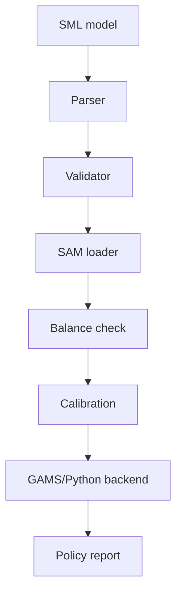

# SML CGE Workbench

Last updated: 2026-05-08

## SML Philosophy

Signal Modeling Language (SML) is intended to make economic model specification more readable, inspectable, and AI-assisted. It sits between informal policy questions and formal model execution.

## Current Capabilities

- Parse SML text.
- Validate required model sections.
- Load example SML files.
- Export placeholder GAMS-compatible code.
- Export placeholder Pyomo-compatible code.
- Prepare simulation bundles.

## CGE Integration Strategy

## GAMS Compatibility

GAMS support appears in:

- `backends/gams/`
- `sml_workbench/exporters/gams_exporter.py`
- `src/cge/gams.py`

Signal treats GAMS as a modeling environment, while solvers such as PATH, CONOPT, and IPOPT are mathematical engines.

## Simulation Architecture

The simulation pathway includes:

- SML parsing
- SAM matrix preparation
- validation and diagnostics
- shock extraction
- solver selection
- policy interpretation
- report generation

## Future Policy Simulation Workflows

Future workflows should connect behavioral signals to SML/CGE scenarios, such as:

- demand shock by sector
- county-specific household welfare analysis
- price shock simulation
- employment and youth impacts
- cost-of-living scenario analysis

