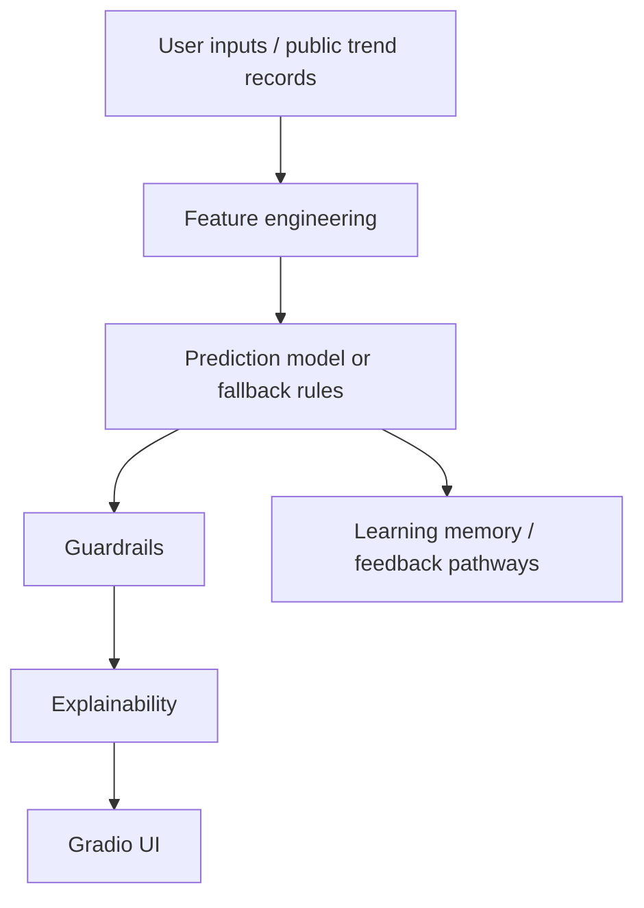
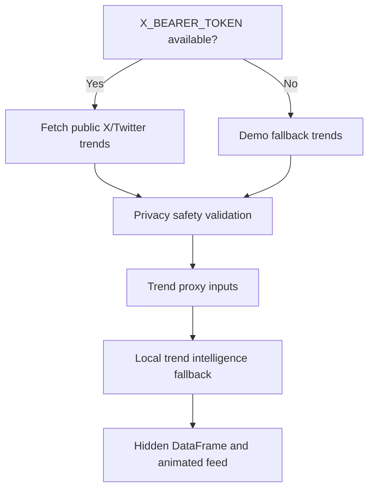
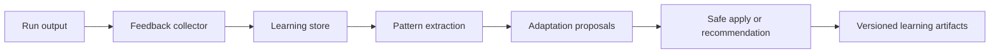

# Signal System Architecture

Last updated: 2026-05-08

## Repository Structure

```text
.
├── app.py                         # Gradio dashboard and integrated UI callbacks
├── train_model.py                 # Training pipeline for the behavioral demand model
├── trend_intelligence.py          # Trend-to-intelligence transformation
├── x_trends.py                    # X/Twitter public trend fetcher with demo fallback
├── privacy.py                     # Aggregate-only trend safety helpers
├── explainability.py              # Prediction explanation and driver summaries
├── adaptive_learning.py           # Feedback log utilities
├── api/                           # FastAPI routes for model, result, scenario, learning workflows
├── backends/gams/                 # GAMS-compatible generation and runner helpers
├── cge_core/                      # SAM, calibration, validation, shocks, closures, results
├── docs/                          # Earlier technical notes
├── Documentation/                 # Comprehensive project documentation system
├── knowledge_base/                # Domain notes for solvers, SAMs, policy, and GAMS errors
├── learning/                      # AI teaching/explainer content
├── learning_memory/               # Run memory and issue pattern storage
├── live_trends/                   # Live trend package placeholder
├── ml/                            # ML preprocessing, training, registry, anomaly, NLP modules
├── models/                        # Saved model artifacts and metadata
├── policy_intelligence/           # Policy interpretation and reports
├── signal_execution/              # SML execution workflow and diagnostics
├── signal_learning/               # Adaptive learning workflow and implementation engine
├── signal_modeling_language/      # SML grammar, parser, validator, schema, examples
├── sml_workbench/                 # Parser, validators, exporters, scenario runner
├── solvers/                       # Solver abstraction layer
├── src/                           # Core schemas, model, data, features, CGE, intelligence modules
└── tests/                         # Unit and integration tests
```

## Application Architecture

`app.py` is the Hugging Face-compatible entry point. It builds a Gradio `Blocks` app with these major tabs:

- Behavioral Signals AI
- Signal CGE Framework
- SML CGE Workbench
- Learning

Behavioral Signals AI contains the main revealed-demand UI, a visible static live trend intelligence card, the embedded live trend data flow, gauges, radar chart, driver cards, and explanatory outputs.

## Data Flow



## Trend Intelligence Flow



The emergency circular-import fix keeps `trend_intelligence.py` independent of `app.py`. This prevents Gradio from re-importing the UI while components are being created.

## Prediction Engine Flow

Key functions in `app.py`:

- `predict_demand_details`
- `predict_demand`
- `update_behavioral_dashboard`
- `_build_signal_features`
- `_predict_with_model`
- `_predict_with_fallback`
- `_apply_guardrails`
- `_calculate_intelligence_scores`
- `_build_visual_components`

The system first attempts to use saved model artifacts under `models/`. If unavailable, it uses fallback rules designed to keep the dashboard operational.

## Adaptive Learning Flow

Adaptive learning is split across:

- `adaptive_learning.py`
- `learning_memory/`
- `signal_learning/`
- `api/routes_learning.py`



## Gradio Architecture

The Gradio app uses:

- `gr.Blocks` as the main container.
- `gr.Tab` for domain sections.
- `gr.Number`, `gr.Slider`, `gr.Textbox`, `gr.HTML`, `gr.Dataframe`, and `gr.Code` for UI components.
- `Button.click`, `Component.change`, `Timer.tick`, and `demo.load` for callbacks.

Callbacks are expected to return plain values only, never Gradio component objects. This is important because component-object returns can trigger runtime errors and schema mismatches.

## Hugging Face Deployment Structure

The repository is configured as a Hugging Face Space using the README front matter:

```yaml
sdk: gradio
sdk_version: 5.13.0
app_file: app.py
```

The GitHub workflow `.github/workflows/sync-to-huggingface.yml` syncs `main` to the Hugging Face Space `Signal-ai/signal-ai-dashboard` using `HF_TOKEN`.

