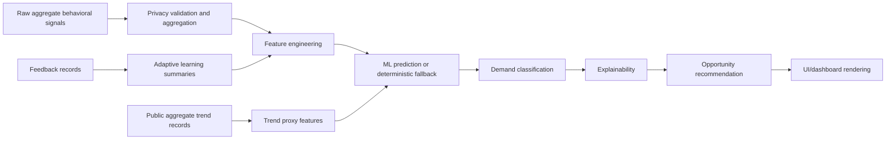

# Behavioral Signals AI Architecture Overview

## Scope

Behavioral Signals AI is the behavioral-intelligence product domain inside the Signal ecosystem. Its role is to convert aggregate behavioral signals into demand intelligence, opportunity scoring, explanation, trend monitoring, and privacy-preserving recommendations for the public Hugging Face dashboard and future APIs.

This document reflects an inspection of:

- the local Windows folder `Behavioral_Signals_AI/`
- the GitHub repository tree at `origin/main`
- the public GitHub repository page, which shows the normalized two-domain layout with `Behavioral_Signals_AI/`, `Signal_CGE/`, `app_routes/`, `app.py`, `requirements.txt`, and root metadata files

Local `HEAD` and `origin/main` were both at commit `87c8b4a Remove care dashboard references from CGE route` during inspection. No Behavioral_Signals_AI sync gap was detected before adding this documentation. The local working tree did contain unrelated dirty Signal_CGE files; those are outside this Behavioral inspection.

## Current System Status

Behavioral Signals AI is best classified as a partially operational system.

It is more than a prototype because:

- the public Gradio app imports Behavioral modules and exposes a working Behavioral Signals AI tab;
- a deterministic route exists at `Behavioral_Signals_AI/app/routes/behavioral_route.py`;
- saved model artifacts exist under `Behavioral_Signals_AI/models/`;
- feature engineering, supervised training, prediction, explainability, privacy filtering, live trend fallback, and opportunity-recommendation modules exist;
- tests in the broader repository exercise many behavioral components.

It is not yet production-ready because:

- some modules still use legacy imports such as `from src...`, `from privacy...`, and `from data...`;
- multiple parallel implementations exist under `app/src/`, `ml/_merged/`, root `app_routes/`, and `_merged` API folders;
- live trend intelligence uses a local fallback predictor rather than the shared model pipeline;
- training paths are inconsistent across `training/`, `app/src/models/`, and deployed `models/`;
- generated artifacts and model binaries are committed alongside source;
- county-level forecasting and business/policy recommendation workflows are not yet unified into a single service layer.

## Product Boundaries

Behavioral Signals AI owns:

- aggregate behavioral feature engineering
- demand classification
- opportunity scoring
- trend intelligence
- explainability
- adaptive feedback logging
- privacy-preserving analytics
- behavioral model artifacts
- future forecasting and county-level intelligence

Signal CGE owns economic simulation, SAM/CGE/GAMS/SML modeling, solver execution, and policy-simulation reports. Behavioral Signals AI may provide aggregate demand signals to Signal CGE later, but it should not import CGE internals for the core behavioral prediction workflow.

## Runtime Flow

## Active Runtime Entry Points

The Hugging Face `app.py` currently references Behavioral Signals AI through:

- `app_routes.behavioral_route.run_behavioral_signal_prediction`
- `Behavioral_Signals_AI.explainability.generate_prediction_explanation`
- `Behavioral_Signals_AI.privacy.PRIVACY_NOTICE`, with an app-level fallback if unavailable
- `Behavioral_Signals_AI.live_trends.trend_intelligence.analyze_trend_batch`
- `Behavioral_Signals_AI.live_trends.trend_intelligence.summarize_trend_batch`
- `Behavioral_Signals_AI.live_trends.x_trends.fetch_x_trends`
- `Behavioral_Signals_AI.live_trends.x_trends.get_demo_trends`
- model files under `Behavioral_Signals_AI/models/`

The direct route implementation is `Behavioral_Signals_AI/app/routes/behavioral_route.py`. There is also a root `app_routes/behavioral_route.py` in the GitHub layout, which currently duplicates or mirrors the product route for deployment compatibility.

## What Already Works

- Aggregate input scoring through `run_behavioral_signal_prediction`.
- Simple demand classification into high, moderate, and low demand bands.
- Explanation of key aggregate drivers.
- Privacy-safe X trend fallback records when no bearer token is configured.
- Basic public trend proxy conversion into demand-like scores.
- Synthetic training data generation for the deployed classifier.
- Saved model loading in `app.py` and `app/src/models/signal_demand_model.py`.
- Privacy filters that reject obvious PII columns and PII-like text.
- Opportunity labels, value propositions, and market-access recommendations in `app/src/intelligence/`.

## Partially Implemented Areas

- ML pipeline: multiple versions exist and are not yet unified.
- Adaptive learning: feedback logging exists, but automated retraining governance is not yet connected to the public UI.
- Live trend intelligence: fetch/fallback exists, but shared model scoring is not consistently reused.
- API layer: `_merged` FastAPI-style modules exist but are not the public deployment path.
- County-level intelligence: data fields and location config exist, but no coherent county forecasting service exists yet.
- Business/policy recommendations: opportunity text exists, but recommendations are not yet calibrated to counties, sectors, or intervention types.

## Placeholder Or Fallback Logic

- `live_trends/trend_intelligence.py` contains a local `predict_demand_details` fallback.
- `live_trends/x_trends.py` falls back to demo trend records when `X_BEARER_TOKEN` is absent.
- `ml/_merged/prediction_engine.py` falls back to quantile rules when no model is loaded.
- Several `_merged` folders appear to be preserved migration copies rather than active canonical code.

## Architectural Concerns

- `Behavioral_Signals_AI.live_trends.trend_intelligence` imports `sanitize_trend_record` from `privacy`, but the domain privacy implementation lives at `Behavioral_Signals_AI/explainability/privacy.py`.
- `Behavioral_Signals_AI.live_trends.x_trends` imports `assert_privacy_safe_records` from `privacy`, with the same import-root problem.
- Many `app/src` modules import from `src...`, which only works if `Behavioral_Signals_AI/app` is added to `PYTHONPATH`.
- `training/train_model.py` imports from `data.synthetic...`, but the synthetic generator is under `Behavioral_Signals_AI/utils/data/synthetic/`.
- `Behavioral_Signals_AI/Documentation/` contains many Signal CGE documents, which should eventually move to `Signal_CGE/Documentation/`.

## Recommended Architectural Direction

Make `Behavioral_Signals_AI/app/src/` the canonical behavioral engine or move its services into top-level packages with explicit imports. Then keep:

- `Behavioral_Signals_AI/app/routes/` as product route hooks;
- `Behavioral_Signals_AI/app/src/data_pipeline/` as canonical privacy and data loading;
- `Behavioral_Signals_AI/app/src/features/` as canonical feature engineering;
- `Behavioral_Signals_AI/app/src/models/` as canonical training and prediction;
- `Behavioral_Signals_AI/app/src/intelligence/` as canonical recommendations;
- `Behavioral_Signals_AI/live_trends/` as the public trend adapter, not as an independent prediction engine;
- `Behavioral_Signals_AI/adaptive_learning/` as feedback and retraining governance.

