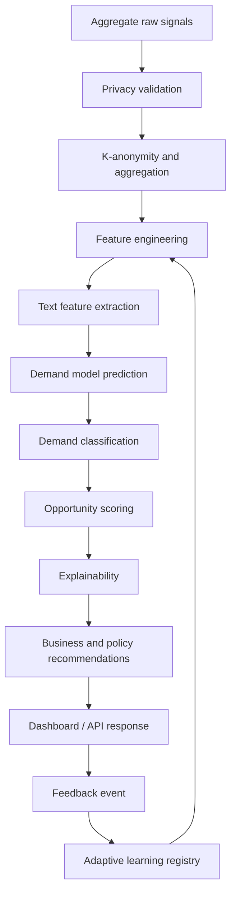
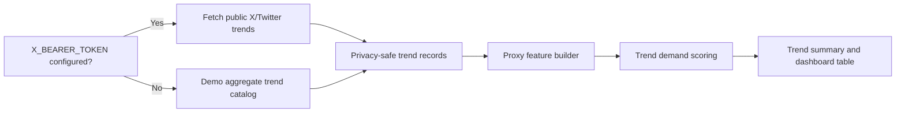

# Behavioral Signals AI Runtime Flow

## Public Gradio Path

The public Hugging Face app enters through root `app.py`. The Behavioral Signals AI tab accepts aggregate inputs such as likes, comments, shares, searches, engagement intensity, purchase intent, and trend growth.

Current public flow:

1. `app.py` receives aggregate inputs from the Gradio UI.
2. `predict_demand_details(...)` loads or falls back from model artifacts under `Behavioral_Signals_AI/models/`.
3. Guardrails and visual-intelligence logic in `app.py` shape the displayed result.
4. `Behavioral_Signals_AI.explainability.generate_prediction_explanation(...)` creates key drivers and a policy note.
5. `run_behavioral_signal_prediction(...)` in the route layer provides a deterministic domain-route payload.
6. The UI renders classification, scores, driver explanation, and live trend panels.

## Canonical Pipeline Target

## Existing Data Flow Components

| Stage | Current module | Current behavior |
|---|---|---|
| Raw data | `utils/data/*.csv`, `app/src/data_pipeline/data_loader.py` | Loads aggregate sample and synthetic data. |
| Privacy validation | `app/src/data_pipeline/privacy_filter.py`, `explainability/privacy.py` | Rejects PII columns and unsafe trend fields; two implementations need consolidation. |
| Feature engineering | `app/src/features/feature_engineering.py` | Builds numeric and text-derived features from aggregate rows. |
| NLP features | `app/src/features/text_features.py`, `ml/_merged/nlp_signal_extractor.py` | Keyword rules and optional NLP fallback tooling. |
| Model prediction | `app/src/models/signal_demand_model.py`, `app/src/models/predict_demand.py`, root `app.py` | Multiple paths; public app currently has its own artifact load/fallback logic. |
| Opportunity intelligence | `app/src/intelligence/opportunity_engine.py`, `market_access.py`, `recommendations.py`, `competitor_analysis.py` | Adds value propositions, market access, and recommendation text. |
| Explainability | `explainability/explainability.py` | Simple transparent driver summaries. |
| Trend intelligence | `live_trends/x_trends.py`, `live_trends/trend_intelligence.py` | Fetches public aggregate trends or demo fallback, then converts into proxy demand outputs. |
| Adaptive learning | `adaptive_learning/adaptive_learning.py`, `ml/_merged/adaptive_learning.py` | Feedback logging and aggregate summaries exist but are not yet a closed retraining loop. |

## Live Trend Runtime Flow

Important runtime caveat: `live_trends/trend_intelligence.py` and `live_trends/x_trends.py` import privacy helpers from `privacy`, which is not a stable product-domain import. `app.py` catches failures and provides fallbacks, so the deployed app remains resilient, but the modules should be normalized.

## API Runtime Flow

`api/_merged/` contains a FastAPI-style service layer with routes for models, scenarios, results, and learning. It is not the current public Hugging Face path. It can become the future external API layer after imports are normalized from `src...` to explicit `Behavioral_Signals_AI.app.src...` or after `app/src` is installed as a package.

## Signal CGE Interaction

Behavioral Signals AI should interact with Signal CGE through explicit, aggregate-safe interfaces only. Examples:

- pass aggregate demand-classification summaries into economic scenario design;
- use county/category opportunity scores to suggest sectors for CGE scenarios;
- export behavioral signal summaries as structured inputs, not individual data.

The behavioral pipeline should not import solver internals or CGE model code.

## Hugging Face Constraints

- No external API should be required for app startup.
- X/Twitter integration must keep demo fallback behavior.
- Model artifacts should be optional; fallback logic must stay transparent.
- Gradio import paths should avoid fragile root wrappers.
- Runtime feedback and outputs should avoid committing generated files.

