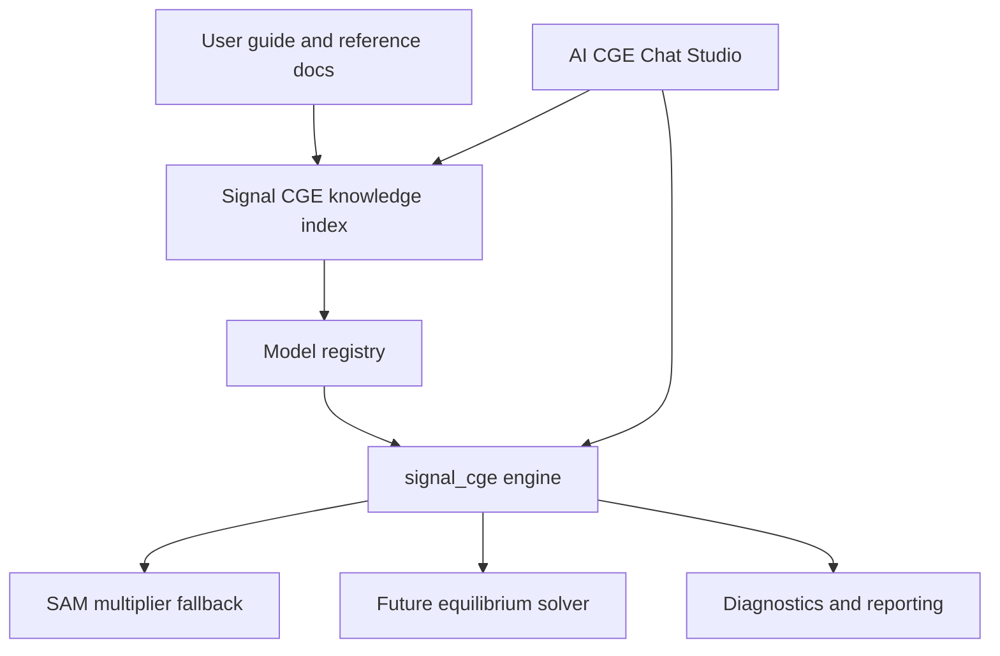
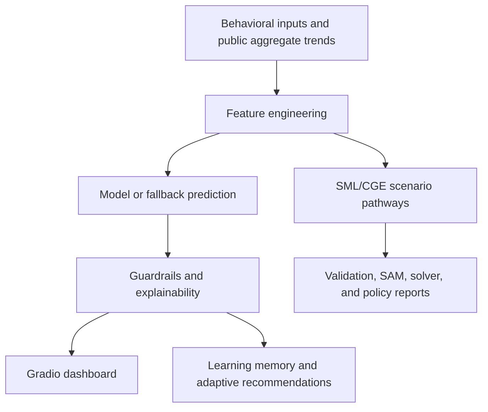

# Signal AI Preference Model

Signal is an integrated AI platform with two public product domains: Behavioral Signals AI and Signal CGE.

## Platform Overview

Signal brings together five core capabilities:

1. Behavioral Signals AI
2. Live Trends Intelligence
3. SML CGE Workbench
4. Economic Simulation and CGE/SAM workflows
5. Learning and AI teaching support

The trained machine-learning model remains the primary prediction engine for demand intelligence in the dashboard.

## Public Interface

The Hugging Face app exposes two public tabs:

1. **Behavioral Signals AI**: aggregate behavioral signal prediction, demand classification, opportunity scoring, and live trend intelligence.
2. **Signal CGE**: a prompt-driven AI-native CGE/SAM simulation studio for policy scenarios, diagnostics, readiness checks, fallback simulation, charts, downloads, and policy interpretation. It runs from the repository-stored canonical model profile by default; uploads are optional custom overrides.

Framework, SML, learning, and older chat-studio modules remain in the repository as backend/internal capabilities, but they are no longer exposed as separate public tabs. See [Signal Two-Tab Public Interface](Documentation/SIGNAL_TWO_TAB_INTERFACE.md).

Product-domain ownership is documented in [Signal Product Domain Map](Documentation/SIGNAL_PRODUCT_DOMAIN_MAP.md). The public app routes through `app_routes/` so Behavioral Signals AI and Signal CGE use their product-domain backend folders.

Signal CGE also includes repo-based knowledge retrieval and metadata-only adaptive learning. See [Signal CGE Repo Knowledge Integration](Documentation/SIGNAL_CGE_REPO_KNOWLEDGE_INTEGRATION.md) and [Signal CGE Adaptive Learning Policy](Documentation/SIGNAL_CGE_ADAPTIVE_LEARNING_POLICY.md).
The newer adaptive intelligence layer is documented in [Signal CGE Adaptive Intelligence](Documentation/SIGNAL_CGE_ADAPTIVE_INTELLIGENCE.md), [Signal CGE Repo Learning Engine](Documentation/SIGNAL_CGE_REPO_LEARNING_ENGINE.md), and [Signal CGE Safe Adaptation Policy](Documentation/SIGNAL_CGE_SAFE_ADAPTATION_POLICY.md).
The full-model blueprint is documented in [Signal CGE Full Model Roadmap](Documentation/SIGNAL_CGE_FULL_MODEL_ROADMAP.md), [Signal CGE Equation Registry](Documentation/SIGNAL_CGE_EQUATION_REGISTRY.md), [Signal CGE Experiment Engine](Documentation/SIGNAL_CGE_EXPERIMENT_ENGINE.md), and [Signal CGE Closure Manager](Documentation/SIGNAL_CGE_CLOSURE_MANAGER.md).

## Signal CGE Architecture

Signal now includes an AI-native CGE/SAM architecture organized around the canonical `Signal_CGE/signal_cge/` package.

- **Signal CGE Framework:** formal model structure, calibration, closures, diagnostics, solver interfaces, and reporting.
- **AI CGE Chat Studio:** natural-language policy simulation interface that compiles prompts into structured scenarios.
- **SML CGE Workbench:** readable model specification, validation, and export preparation.
- **Learning:** guided explanations of SAMs, CGE blocks, calibration, closures, diagnostics, and policy interpretation.

The current operational backend is the Python SAM multiplier fallback. Signal also includes a calibration prototype and formal model-core blocks that prepare the project for a future open-source equilibrium solver and recursive dynamics. Optional GAMS and future Pyomo/SciPy pathways remain guarded so Hugging Face deployment can start without them.

## Signal CGE Canonical Architecture

The canonical Signal CGE knowledge system is stored in `Documentation/signal_cge_reference/` and connected to the model through `Signal_CGE/signal_cge/model_registry.py` plus `Signal_CGE/signal_cge/knowledge/`.



Canonical folders:

- `Documentation/signal_cge_reference/user_guides/`: adapted Signal CGE user guide in Word and PDF form.
- `Documentation/signal_cge_reference/equations/`: model-block equation references.
- `Documentation/signal_cge_reference/calibration/`: SAM calibration workflow.
- `Documentation/signal_cge_reference/closures/`: closure-system documentation.
- `Documentation/signal_cge_reference/experiments/`: experiment workflow documentation.
- `Signal_CGE/models/canonical/signal_cge_master/`: canonical model profile.
- `Signal_CGE/models/canonical/templates/`, `calibration_profiles/`, and `experiment_templates/`: future reusable model assets.

## Documentation Navigation

The full project documentation system is available under `Documentation/`.

### Start Here

- [Project Overview](Documentation/PROJECT_OVERVIEW.md)
- [Signal Vision](Documentation/SIGNAL_VISION.md)
- [System Architecture](Documentation/SYSTEM_ARCHITECTURE.md)
- [Development Log](Documentation/DEVELOPMENT_LOG.md)
- [Changelog](Documentation/CHANGELOG.md)

### Implementation Guides

- [Behavioral AI Engine](Documentation/BEHAVIORAL_AI_ENGINE.md)
- [Live Trends Module](Documentation/LIVE_TRENDS_MODULE.md)
- [SML CGE Workbench](Documentation/SML_CGE_WORKBENCH.md)
- [Adaptive Learning](Documentation/ADAPTIVE_LEARNING.md)
- [Learning Module](Documentation/LEARNING_MODULE.md)
- [Model Logic](Documentation/MODEL_LOGIC.md)
- [Data Pipeline](Documentation/DATA_PIPELINE.md)
- [UI/UX Design](Documentation/UI_UX_DESIGN.md)
- [API and Integrations](Documentation/API_AND_INTEGRATIONS.md)

### Operations

- [Deployment Guide](Documentation/DEPLOYMENT_GUIDE.md)
- [Hugging Face Setup](Documentation/HUGGINGFACE_SETUP.md)
- [GitHub Workflow](Documentation/GITHUB_WORKFLOW.md)
- [Debugging and Fixes](Documentation/DEBUGGING_AND_FIXES.md)
- [Security and Privacy](Documentation/SECURITY_AND_PRIVACY.md)
- [Known Issues](Documentation/KNOWN_ISSUES.md)
- [Future Roadmap](Documentation/FUTURE_ROADMAP.md)

### Session History

- [Session 001](Documentation/SESSION_HISTORY/session_001.md)
- [Session 002](Documentation/SESSION_HISTORY/session_002.md)
- [Session 003](Documentation/SESSION_HISTORY/session_003.md)
- [Session 004](Documentation/SESSION_HISTORY/session_004.md)

## Repository Structure

```text
app.py
requirements.txt
README.md

Product domains:
  Behavioral_Signals_AI/
    behavioral_ai/
    adaptive_learning/
    live_trends/
    explainability/
    data/
    models/
    docs/

  Signal_CGE/
    backends/
    signal_cge/
    signal_ai/
    signal_sml/
    sml_workbench/
    policy_ai/
    cge_workbench/
    cge_core/
    cge_engine/
    solvers/
    signal_execution/
    signal_modeling_language/
    policy_intelligence/
    models/
    docs/
    outputs/

Shared root:
  app.py
  app_routes/
  requirements.txt
  README.md
  tests/
  Documentation/
  .github/
  .gitattributes
  .gitignore
  pytest.ini

Compatibility wrappers:
  root imports such as api, src, ml, data, signal_cge, signal_ai,
  policy_ai, sml_workbench, cge_workbench, cge_core, solvers,
  adaptive_learning, explainability, train_model, trend_intelligence,
  and x_trends remain available during migration.

Testing and documentation:
  tests/
  Documentation/
```

For the current ownership map and migration plan, see [Signal Product Domain Map](Documentation/SIGNAL_PRODUCT_DOMAIN_MAP.md), [Two-Domain Reorganization Plan](Documentation/TWO_DOMAIN_REPOSITORY_REORGANIZATION_PLAN.md), and [Signal Repository Migration Roadmap](Documentation/SIGNAL_REPOSITORY_MIGRATION_ROADMAP.md).

## Architecture Summary



Signal is organized as a modular intelligence platform. `app.py` provides the Gradio user experience; `Behavioral_Signals_AI/train_model.py`, `Behavioral_Signals_AI/ml/`, and `Behavioral_Signals_AI/src/models/` support model training and prediction; `Behavioral_Signals_AI/trend_intelligence.py` and `Behavioral_Signals_AI/x_trends.py` support aggregate live trend intelligence; `Signal_CGE/signal_cge/` is the canonical CGE/SAM engine; `Signal_CGE/signal_ai/` provides the AI-native CGE chat layer; `Signal_CGE/sml_workbench/` remains the active SML workbench until migration into `Signal_CGE/signal_sml/`; `Signal_CGE/learning/` remains the active teaching layer; and `Signal_CGE/signal_learning/` plus `Signal_CGE/learning_memory/` support adaptive learning.

## Module Descriptions

### Behavioral Intelligence Layer

Uses aggregate behavioral signals such as likes, comments, shares, searches, and live trend proxies to estimate:

- demand classification
- confidence
- aggregate demand
- opportunity
- emerging trend probability
- unmet demand probability

### Live Trends Layer

Uses public aggregate X/Twitter topic-level trends only. No usernames, private messages, or individual profiles are stored.

### SML Workbench

The integrated `sml_workbench/` package supports:

- loading SML text
- parsing SML sections
- validating required sections
- exporting placeholder GAMS-ready text
- exporting placeholder Pyomo-ready text
- preparing future simulation bundles

### Learning Module

The integrated `learning/` package provides concept explanations for:

- Signal
- revealed preference intelligence
- behavioral signals
- demand classification
- opportunity scoring
- unmet demand
- emerging trends
- SAMs
- CGE models
- SML
- policy simulation

## Run Locally

Launch the Gradio dashboard:

```powershell
.\.venv\Scripts\python.exe app.py
```

Launch the API locally:

```powershell
.\.venv\Scripts\python.exe -m uvicorn api.main:app --reload
```

## Train the Behavioral Model

Retrain the main demand model:

```powershell
.\.venv\Scripts\python.exe train_model.py
```

## Use the SML Workbench

Validate an SML model in Python:

```powershell
.\.venv\Scripts\python.exe -c "from sml_workbench.parser.sml_parser import parse_sml; from sml_workbench.validators.sml_validator import validate_sml; text=open('signal_modeling_language/examples/basic_cge.sml', encoding='utf-8').read(); parsed=parse_sml(text); print(validate_sml(parsed))"
```

The Gradio `SML CGE Workbench` tab also uses the integrated parser, validator, and exporter layer.

## Use the Learning Module

Get an AI teaching explanation:

```powershell
.\.venv\Scripts\python.exe -c "from learning.ai_teaching.explainer import explain_concept; print(explain_concept('SML'))"
```

The Gradio `Learning` tab now includes a learning-topic explainer driven by this module.

## Hugging Face Deployment Notes

- Keep `app.py` at the repository root
- Keep `requirements.txt` at the repository root
- Do not hard-code secrets
- Use Hugging Face Spaces secrets for tokens such as `X_BEARER_TOKEN`
- The dashboard remains stable when optional live-trend credentials are missing because fallback demo trends are built in

See the full [Deployment Guide](Documentation/DEPLOYMENT_GUIDE.md) and [Hugging Face Setup](Documentation/HUGGINGFACE_SETUP.md).

## Roadmap Summary

Planned platform directions include county intelligence, election intelligence, sentiment analysis, heatmaps, forecasting, explainability upgrades, autonomous learning, real-time public intelligence, policy simulation expansion, and enterprise deployment. See [Future Roadmap](Documentation/FUTURE_ROADMAP.md).

## Privacy Summary

Signal is designed for aggregate behavioral intelligence. It should not track individuals or store usernames, private messages, personal profiles, phone numbers, or email addresses. See [Security and Privacy](Documentation/SECURITY_AND_PRIVACY.md).

## Tests

Run the full test suite:

```powershell
.\.venv\Scripts\python.exe -m pytest
```

## Architecture Docs

See:

- `Documentation/SIGNAL_PLATFORM_ARCHITECTURE.md`
- `Documentation/INTERPRETATION_AND_VISUAL_INTELLIGENCE.md`
- `Documentation/LIVE_X_TRENDS_MODULE.md`
- `Documentation/SYSTEM_ARCHITECTURE.md`
- `Documentation/PROJECT_OVERVIEW.md`
