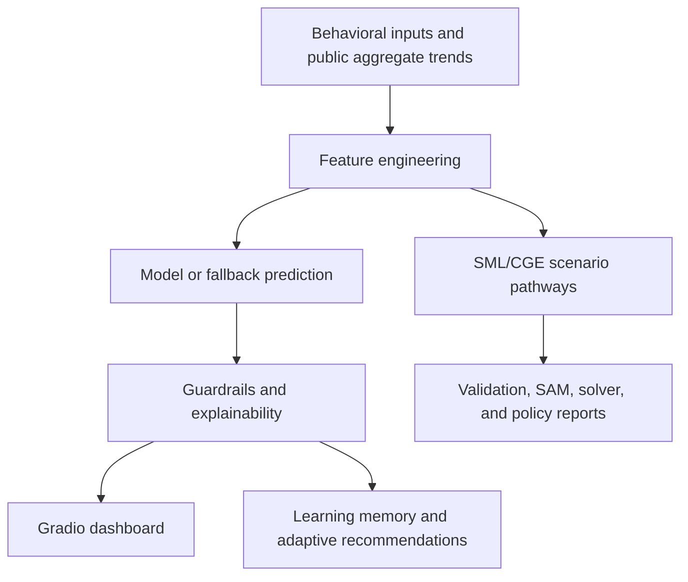

# Signal AI Preference Model

Signal is an integrated AI platform for behavioral intelligence, revealed preference analysis, live trend monitoring, SML-based CGE/SAM modeling, and learning support.

## Platform Overview

Signal brings together five core capabilities:

1. Behavioral Signals AI
2. Live Trends Intelligence
3. SML CGE Workbench
4. Economic Simulation and CGE/SAM workflows
5. Learning and AI teaching support

The trained machine-learning model remains the primary prediction engine for demand intelligence in the dashboard.

## Documentation Navigation

The full project documentation system is available under `Documentation/`.

### Start Here

- [Project Overview](Documentation/PROJECT_OVERVIEW.md)
- [Signal Vision](Documentation/SIGNAL_VISION.md)
- [System Architecture](Documentation/SYSTEM_ARCHITECTURE.md)
- [Development Log](Documentation/DEVELOPMENT_LOG.md)
- [Changelog](Documentation/CHANGELOG.md)

### Implementation Guides

- [Behavioral AI Engine](Documentation/BEHAVIORAL_AI_ENGINE.md)
- [Live Trends Module](Documentation/LIVE_TRENDS_MODULE.md)
- [SML CGE Workbench](Documentation/SML_CGE_WORKBENCH.md)
- [Adaptive Learning](Documentation/ADAPTIVE_LEARNING.md)
- [Learning Module](Documentation/LEARNING_MODULE.md)
- [Model Logic](Documentation/MODEL_LOGIC.md)
- [Data Pipeline](Documentation/DATA_PIPELINE.md)
- [UI/UX Design](Documentation/UI_UX_DESIGN.md)
- [API and Integrations](Documentation/API_AND_INTEGRATIONS.md)

### Operations

- [Deployment Guide](Documentation/DEPLOYMENT_GUIDE.md)
- [Hugging Face Setup](Documentation/HUGGINGFACE_SETUP.md)
- [GitHub Workflow](Documentation/GITHUB_WORKFLOW.md)
- [Debugging and Fixes](Documentation/DEBUGGING_AND_FIXES.md)
- [Security and Privacy](Documentation/SECURITY_AND_PRIVACY.md)
- [Known Issues](Documentation/KNOWN_ISSUES.md)
- [Future Roadmap](Documentation/FUTURE_ROADMAP.md)

### Session History

- [Session 001](Documentation/SESSION_HISTORY/session_001.md)
- [Session 002](Documentation/SESSION_HISTORY/session_002.md)
- [Session 003](Documentation/SESSION_HISTORY/session_003.md)
- [Session 004](Documentation/SESSION_HISTORY/session_004.md)

## Repository Structure

```text
app.py
requirements.txt
README.md

behavioral_ai/
live_trends/
adaptive_learning/
explainability/

sml_workbench/
learning/
cge_engine/

data/
models/
tests/
Documentation/
outputs/
```

Important existing integrated layers also remain in the repository:

- `signal_modeling_language/`
- `signal_execution/`
- `signal_learning/`
- `cge_core/`
- `policy_intelligence/`
- `src/`

## Architecture Summary



Signal is organized as a modular intelligence platform. `app.py` provides the Gradio user experience; `train_model.py`, `ml/`, and `src/models/` support model training and prediction; `trend_intelligence.py` and `x_trends.py` support aggregate live trend intelligence; `signal_modeling_language/`, `sml_workbench/`, `cge_core/`, `solvers/`, and `signal_execution/` support SML/CGE workflows; and `signal_learning/` plus `learning_memory/` support adaptive learning.

## Module Descriptions

### Behavioral Intelligence Layer

Uses aggregate behavioral signals such as likes, comments, shares, searches, and live trend proxies to estimate:

- demand classification
- confidence
- aggregate demand
- opportunity
- emerging trend probability
- unmet demand probability

### Live Trends Layer

Uses public aggregate X/Twitter topic-level trends only. No usernames, private messages, or individual profiles are stored.

### SML Workbench

The integrated `sml_workbench/` package supports:

- loading SML text
- parsing SML sections
- validating required sections
- exporting placeholder GAMS-ready text
- exporting placeholder Pyomo-ready text
- preparing future simulation bundles

### Learning Module

The integrated `learning/` package provides concept explanations for:

- Signal
- revealed preference intelligence
- behavioral signals
- demand classification
- opportunity scoring
- unmet demand
- emerging trends
- SAMs
- CGE models
- SML
- policy simulation

## Run Locally

Launch the Gradio dashboard:

```powershell
.\.venv\Scripts\python.exe app.py
```

Launch the API locally:

```powershell
.\.venv\Scripts\python.exe -m uvicorn api.main:app --reload
```

## Train the Behavioral Model

Retrain the main demand model:

```powershell
.\.venv\Scripts\python.exe train_model.py
```

## Use the SML Workbench

Validate an SML model in Python:

```powershell
.\.venv\Scripts\python.exe -c "from sml_workbench.parser.sml_parser import parse_sml; from sml_workbench.validators.sml_validator import validate_sml; text=open('signal_modeling_language/examples/basic_cge.sml', encoding='utf-8').read(); parsed=parse_sml(text); print(validate_sml(parsed))"
```

The Gradio `SML CGE Workbench` tab also uses the integrated parser, validator, and exporter layer.

## Use the Learning Module

Get an AI teaching explanation:

```powershell
.\.venv\Scripts\python.exe -c "from learning.ai_teaching.explainer import explain_concept; print(explain_concept('SML'))"
```

The Gradio `Learning` tab now includes a learning-topic explainer driven by this module.

## Hugging Face Deployment Notes

- Keep `app.py` at the repository root
- Keep `requirements.txt` at the repository root
- Do not hard-code secrets
- Use Hugging Face Spaces secrets for tokens such as `X_BEARER_TOKEN`
- The dashboard remains stable when optional live-trend credentials are missing because fallback demo trends are built in

See the full [Deployment Guide](Documentation/DEPLOYMENT_GUIDE.md) and [Hugging Face Setup](Documentation/HUGGINGFACE_SETUP.md).

## Roadmap Summary

Planned platform directions include county intelligence, election intelligence, sentiment analysis, heatmaps, forecasting, explainability upgrades, autonomous learning, real-time public intelligence, policy simulation expansion, and enterprise deployment. See [Future Roadmap](Documentation/FUTURE_ROADMAP.md).

## Privacy Summary

Signal is designed for aggregate behavioral intelligence. It should not track individuals or store usernames, private messages, personal profiles, phone numbers, or email addresses. See [Security and Privacy](Documentation/SECURITY_AND_PRIVACY.md).

## Tests

Run the full test suite:

```powershell
.\.venv\Scripts\python.exe -m pytest
```

## Architecture Docs

See:

- `Documentation/SIGNAL_PLATFORM_ARCHITECTURE.md`
- `Documentation/INTERPRETATION_AND_VISUAL_INTELLIGENCE.md`
- `Documentation/LIVE_X_TRENDS_MODULE.md`
- `Documentation/SYSTEM_ARCHITECTURE.md`
- `Documentation/PROJECT_OVERVIEW.md`
